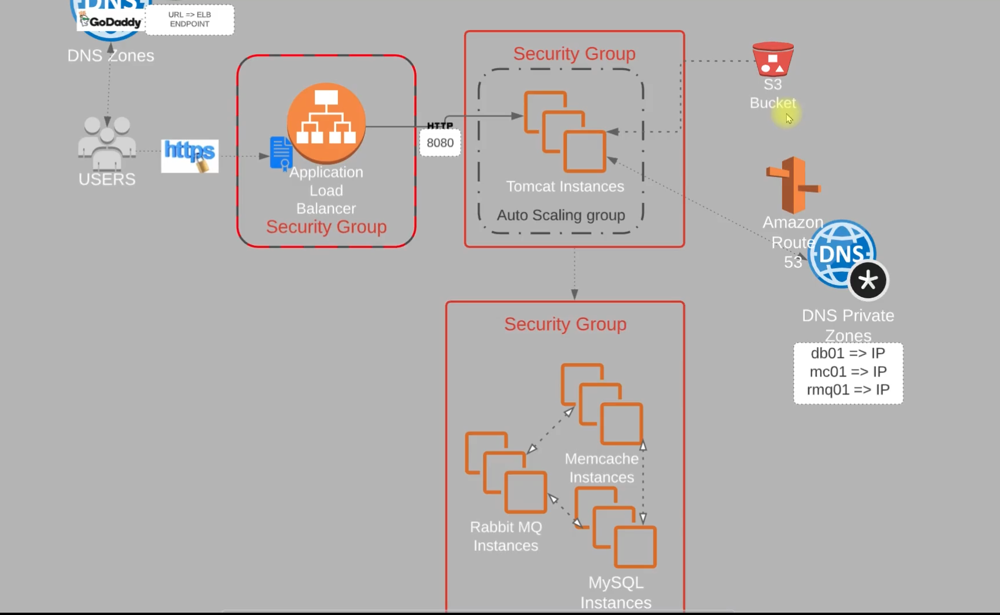

# About The Project

This project demonstrates a **Multi-Tier Web Application Stack (VPROFILE)** designed to be hosted and run on AWS Cloud for production using a **Lift & Shift strategy**. The goal is to migrate existing application workloads to the cloud with minimal changes, leveraging AWS infrastructure for scalability and reliability.

# Scenario

Initially, application services are running on physical or virtual machines within a traditional datacenter. These services include various technologies such as DNS, PostgreSQL, Oracle, Node.js, Apache Tomcat, NGINX, LAMP stack, Java, MySQL, and PHP. The workload is managed within your own datacenter environment, setting the stage for migration to the cloud.

# Problem

Traditional datacenter environments face several challenges:
- **Complex Management:** Managing multiple services and infrastructure components is difficult and time-consuming.
- **Scaling Complexity:** Scaling resources up or down to meet demand is not straightforward and often requires significant manual intervention.
- **High Costs:** There are significant upfront capital expenditures (CapEx) for hardware and ongoing operational expenditures (OpEx) for maintenance and management.

These issues motivate the move to cloud-based solutions using strategies like Lift & Shift.

## Additional Problems

- **Manual Process:** Many tasks require manual intervention, increasing the risk of errors.
- **Difficult to Automate:** Legacy systems and processes are not designed for automation, making it hard to streamline operations.
- **Time Consuming:** Manual and non-automated processes lead to significant time consumption and inefficiency.

# Solution

Moving to a cloud setup addresses the challenges of traditional datacenter management by providing:
- **Automation:** Streamlines processes and reduces manual intervention.
- **Pay-As-You-Go:** Only pay for the resources you use, reducing upfront costs.
- **IaaS (Infrastructure as a Service):** Easily provision and manage infrastructure components on demand.
- **Flexibility:** Scale resources up or down quickly to match workload requirements.
- **Ease of Infrastructure Management:** Simplifies operations and improves efficiency.

Cloud solutions enable organizations to be more agile, cost-effective, and efficient in managing their IT infrastructure.

# AWS Cloud Components Mapping

This project leverages various AWS services to replace traditional infrastructure components:

- **EC2 Instances:** Act as virtual machines for running Tomcat, RabbitMQ, Memcached, and MySQL servers.
- **ELB (Elastic Load Balancer):** Replaces NGINX as the load balancer for distributing traffic.
- **Auto Scaling:** Automates the scaling of virtual machines based on demand.
- **S3/EFS Storage:** Provides shared storage solutions for application data and backups.
- **Route 53:** Offers private DNS services for internal and external domain management.

These AWS services enable a scalable, automated, and highly available cloud infrastructure for the VProfile application.

# Prerequisites
###
- JDK 11
- Maven 3 or later
- MySQL 5.6 or later

# Technologies 
- Spring MVC
- Spring Security
- Spring Data JPA
- Maven
- JSP
- MySQL
# Database
Here,we used Mysql DB 
MSQL DB Installation Steps for Linux ubuntu 14.04:
- $ sudo apt-get update
- $ sudo apt-get install mysql-server

Then look for the file :
- /src/main/resources/accountsdb
- accountsdb.sql file is a mysql dump file.we have to import this dump to mysql db server
- > mysql -u <user_name> -p accounts < accountsdb.sql

# Objective

The main objectives of this project are:
- **Flexible Infrastructure:** Easily scale and adapt resources as needed.
- **No Upfront Cost:** Leverage cloud pay-as-you-go models to avoid large initial investments.
- **Modernize Effectively:** Update and optimize the application stack for modern cloud environments.
- **Iaac (Infrastructure as Code):** Use automation tools to provision and manage infrastructure efficiently.

# Architecture

The architecture of this project is designed for scalability, security, and cloud-native deployment. Key components include:

- **DNS (GoDaddy, Route 53):** Manages public and private DNS zones for user access and internal service discovery.
- **Application Load Balancer:** Distributes incoming HTTPS traffic to Tomcat instances, protected by security groups.
- **Tomcat Instances (Auto Scaling Group):** Hosts the application, automatically scaling based on demand.
- **S3 Bucket:** Provides shared storage for application data and backups.
- **Route 53:** Handles DNS resolution for both public and private zones.
- **Security Groups:** Enforce network segmentation and security for Tomcat, Memcache, RabbitMQ, and MySQL instances.
- **Memcache, RabbitMQ, MySQL Instances:** Support caching, messaging, and database services, each within their own security group.

This architecture ensures high availability, security, and efficient resource utilization in the AWS cloud.

# Flow of Execution

The following are the high-level steps for deploying the VProfile application on AWS:

1. Login to AWS Account
2. Create Key Pairs
3. Create Security groups
4. Launch Instances with user data [BASH SCRIPTS]
5. Update IP to name mapping in Route 53
6. Build Application from source code
7. Upload to S3 bucket
8. Download artifact to Tomcat EC2 Instance
9. Setup ELB with HTTPS [Cert from Amazon Certificate Manager]
10. Map ELB Endpoint to website name in GoDaddy DNS
11. Verify
12. Build Autoscaling Group for Tomcat Instances

These steps outline the end-to-end process for provisioning infrastructure, deploying the application, and ensuring scalability and security in the AWS cloud.

# Domain, SSL, and Security Group Setup

To ensure secure and best-practice cloud deployment, the following steps were performed:

1. **ACM Certificate for Custom Domain**
   - An SSL/TLS certificate was requested from AWS Certificate Manager (ACM) for the domain `basantthvaraganti.xyz` (registered with GoDaddy).
   - Domain ownership was validated by adding the required CNAME record (with the CNAME name and value provided by ACM) to the GoDaddy DNS settings.
   - This enables secure HTTPS connections to your website.

2. **Security Group for Load Balancer**
   - A security group was created for the Application Load Balancer (ALB).
   - This security group allows inbound HTTPS (port 443) and/or HTTP (port 80) traffic from the internet to the load balancer.

3. **Security Group for Tomcat Servers**
   - A separate security group was created for the Tomcat EC2 instances.
   - This security group allows inbound traffic on port 8080, but only from the security group associated with the load balancer (not from the public internet).
   - This ensures that only the load balancer can communicate directly with the Tomcat servers, improving security.

**Why these steps matter:**
- The ACM certificate ensures all traffic to your website is encrypted and secure.
- Security groups act as virtual firewalls, controlling access and reducing the attack surface.
- Restricting Tomcat's access to only the load balancer follows best security practices and protects your application servers from direct public exposure.

These configurations are essential for a secure, scalable, and production-ready cloud deployment.

# Internal Security Group Rules for Application Services

To secure internal communication between your application servers and backend services, the following security group rules were configured:

- **MySQL/Aurora (Port 3306):**
  - **Source:** Tomcat security group (`sg-010857c931e32ff55`)
  - **Purpose:** Allows Tomcat application servers to connect to the MySQL database.

- **Memcached (Port 11211):**
  - **Source:** Tomcat security group (`sg-010857c931e32ff55`)
  - **Purpose:** Allows Tomcat servers to connect to Memcached for caching.

- **RabbitMQ (Port 5672):**
  - **Source:** Tomcat security group (`sg-010857c931e32ff55`)
  - **Purpose:** Allows Tomcat servers to connect to RabbitMQ for messaging.

**Why this setup is important:**
- Follows the principle of least privilege by restricting access to backend services only to the necessary application servers.
- Enhances security by isolating services from public access and other unrelated resources.
- Aligns with AWS best practices for internal service communication and network segmentation.

This configuration ensures that only authorized application servers can access critical backend services, reducing the risk of unauthorized access and improving the overall security posture of your cloud environment.

## Allowing Internal Traffic Within the Backend Security Group

![Backend Security Group Internal Rule]

- **Type:** All traffic (all protocols, all ports)
- **Source:** The backend security group itself (`sg-03dfd52e53d36eabe`)
- **Description:** Allow internal traffic to flow on all ports

**Purpose:**
- This rule allows all instances that are members of the backend security group to communicate freely with each other on any port and protocol.

**Use Case:**
- Useful for backend services (like MySQL, Memcached, RabbitMQ, etc.) that need to communicate with each other for clustering, replication, or other internal operations.

**Security Note:**
- This rule is safe as long as only trusted backend instances are part of this security group. It does not expose these services to the public internet.

This configuration enables seamless service-to-service communication within the backend tier while maintaining isolation from external networks.

## Restricting SSH and Application Access to Your IP

To further enhance security, SSH and direct application access have been restricted to your specific IP address for both the application and backend security groups.

### Application Security Group (`sg-010857c931e32ff55 - vprofile-app-sg`)

- **Port 22 (SSH):**
  - **Source:** Your IP address (`38.49.72.189/32`)
  - **Purpose:** Only your IP can SSH into the application server, preventing unauthorized access from the public internet.

- **Port 8080 (Tomcat Application):**
  - **Source:** Your IP address (`38.49.72.189/32`)
  - **Purpose:** Only your IP can access the Tomcat application directly on port 8080, blocking all other external access.

### Backend Security Group (`sg-03dfd52e53d36eabe - vprofile-backend-SG`)

- **Port 22 (SSH):**
  - **Source:** Your IP address (`38.49.72.189/32`)
  - **Purpose:** Only your IP can SSH into backend servers, ensuring administrative access is tightly controlled.

**Why this is a best practice:**
- Minimizes the risk of brute-force attacks and unauthorized access.
- Limits administrative and debugging access to trusted sources only.
- Follows the principle of least privilege for network access.

This configuration is essential for maintaining a secure cloud environment and protecting your infrastructure from external threats.

